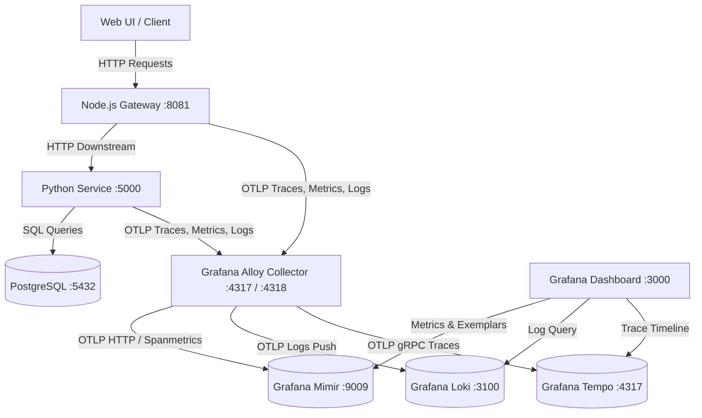

# ⚡ LGTM Observability Mesh & Microservices Architecture

A production-ready microservice demonstration of the **Grafana LGTM (Loki, Grafana, Tempo, Mimir) Stack** combined with **Grafana Alloy** telemetry collector, **PostgreSQL** database infrastructure, **Node.js Gateway**, and **Python Analytical Service**.

Includes an interactive **Glassmorphic Web UI Dashboard** with a **3D WebGL Topology Diagram**, OpenTelemetry distributed tracing, metrics-to-traces exemplars, OTLP log correlation, and a zero-overhead **`ENABLE_OBSERVABILITY` feature flag**.

---

## 📐 Architecture & Data Flow Workflow

### System Architecture Topology

```
                   +----------------------------------+
                   |    Web Control Center (UI)       |
                   |      http://localhost:8081       |
                   +-----------------+----------------+
                                     |
                                     v
                   +----------------------------------+
                   |  Node.js API Gateway (Express)   | (Port 8081)
                   +-----------------+----------------+
                                     |  HTTP REST / W3C Trace Context
                                     v
                   +----------------------------------+
                   | Python Analytics Service (Flask) | (Port 5000)
                   +-----------------+----------------+
                                     |  SQL Queries (SELECT, INSERT)
                                     v
                   +----------------------------------+
                   |    PostgreSQL Database (v15)     | (Port 5432)
                   +----------------------------------+
```

### Telemetry Pipeline & Data Flow Workflow



---

## 🌟 Key Capabilities & Features

- **End-to-End Distributed Tracing**: Native OpenTelemetry W3C tracecontext header propagation across Node.js, Python, and PostgreSQL (`db.system = postgresql`).
- **OpenMetrics Exemplars & RED Spanmetrics**: Connects Prometheus metric spikes directly to trace IDs in Tempo using `otelcol.connector.spanmetrics` in Alloy.
- **OTLP Ingestion Logging**: Ingests Winston (Node.js) and Python logging directly into Loki via OTLP HTTP streams.
- **Glassmorphic 3D Web Control Center**: Interactive dashboard featuring Orbit Three.js WebGL 3D mesh node graph, 1-click test action chips, and real-time response telemetry.
- **Global `ENABLE_OBSERVABILITY` Feature Flag**: Toggle telemetry globally via env var (`ENABLE_OBSERVABILITY=true` / `false`) with built-in zero-overhead No-Op fallbacks.

---

## 🌐 Local Service Endpoints

When running locally via Docker Compose, access the following endpoints:

| Service | Host Port | URL / Endpoint | Description |
| :--- | :--- | :--- | :--- |
| **Web Control Center UI** | `8081` | [http://localhost:8081](http://localhost:8081) | Interactive Glassmorphic 3D Control Dashboard |
| **Grafana Dashboard** | `3000` | [http://localhost:3000](http://localhost:3000) | Observability UI (Anonymous Admin Enabled) |
| **Node.js API Docs** | `8081` | [http://localhost:8081/docs](http://localhost:8081/docs) | Swagger OpenAPI UI |
| **Python App Docs** | `5000` | [http://localhost:5000/docs](http://localhost:5000/docs) | Swagger OpenAPI UI |
| **Prometheus Metrics** | `8081` | [http://localhost:8081/metrics](http://localhost:8081/metrics) | Node.js OpenMetrics endpoint with exemplars |
| **Grafana Alloy UI** | `12345` | [http://localhost:12345](http://localhost:12345) | Collector status & component topology |

---

## 🚀 Quick Start Guide (Docker Compose)

### 1. Build and Launch Infrastructure
Launch the full microservice mesh, database, and LGTM telemetry stack:

```bash
# Start full stack in detached mode
docker compose up --build -d
```

### 2. Run with Observability Disabled (Optional)
To test application performance without telemetry overhead:

```bash
# Run with Observability DISABLED
ENABLE_OBSERVABILITY=false docker compose up -d
```

### 3. Generate Telemetry Signals & Test API Routes

Open `http://localhost:8081` in your browser to use the 1-click control center, or run cURL commands:

```bash
# 1. Fibonacci & Downstream Python Analysis Pipeline
curl http://localhost:8081/calculate/15

# 2. Text Sentiment & Statistics Analysis
curl -X POST http://localhost:8081/text/analyze \
  -H "Content-Type: application/json" \
  -d '{"text":"Awesome speed and fantastic distributed tracing performance!"}'

# 3. Prime Factorization
curl http://localhost:8081/math/prime-factors/1440

# 4. PostgreSQL Database Query
curl http://localhost:8081/user/42

# 5. Fault Injection (500 Error Tracing)
curl http://localhost:8081/error
```

---

## ☸️ Kubernetes Deployment (Helm)

The stack is packaged as a production Helm chart under `helm/lgtm-stack/`.

```bash
# Lint Helm chart templates
helm lint ./helm/lgtm-stack

# Install onto Kubernetes / EKS
helm install lgtm ./helm/lgtm-stack \
  --set global.enableObservability=true \
  --set global.storageClass="gp3"
```

---

## ⚙️ Environment Variables & ConfigMap Reference

| Variable Name | Default Value | Description |
| :--- | :--- | :--- |
| `PORT` | `8081` (Node) / `5000` (Py) | Express / Flask HTTP listening port. |
| `ENABLE_OBSERVABILITY` | `true` | Set to `false` to disable telemetry globally without code breaks. |
| `PYTHON_SERVICE_URL` | `http://python-app:5000` | Gateway URL for Node.js -> Python downstream communication. |
| `POSTGRES_HOST` | `postgres` | Hostname of the PostgreSQL database instance. |
| `POSTGRES_PORT` | `5432` | Port for PostgreSQL connections. |
| `POSTGRES_DB` | `lgtmdb` | Database name for PostgreSQL (`.Values.postgres.database`). |
| `POSTGRES_USER` | `lgtmuser` | Username for PostgreSQL (`.Values.postgres.user`). |
| `POSTGRES_PASSWORD` | `lgtmpass` | Password for PostgreSQL (`.Values.postgres.password`). |
| `OTEL_EXPORTER_OTLP_ENDPOINT` | `http://alloy:4318` | Base OTLP HTTP collector endpoint. |
| `MIMIR_OTLP_ENDPOINT` | `http://mimir:9009/otlp` | OTLP HTTP push URL for Grafana Mimir metrics. |
| `LOKI_PUSH_URL` | `http://loki:3100/loki/api/v1/push` | Push URL for Grafana Loki log ingestion. |
| `TEMPO_OTLP_ENDPOINT` | `tempo:4317` | OTLP gRPC endpoint for Grafana Tempo traces. |

---

## 🔍 Grafana Telemetry Correlation Workflow

1. **Logs ➔ Traces**: Open Grafana Explore (`http://localhost:3000`), choose **Loki**, query `{job="node-app"}` or `{job="python-app"}`. Expand any log record and click **"View Trace"** next to `trace_id` to view the distributed timeline in Tempo.
2. **Traces ➔ Logs**: On any span timeline in Tempo, click **"Logs for this span"** to automatically jump to Loki logs filtered by matching span timestamps and service labels.
3. **Metrics ➔ Traces (Exemplars)**: Select **Mimir / Prometheus** in Grafana Explore, enable **Exemplars**, and query `node_task_duration_seconds_bucket`. Click any blue exemplar data point to hop straight into its Tempo trace timeline.
