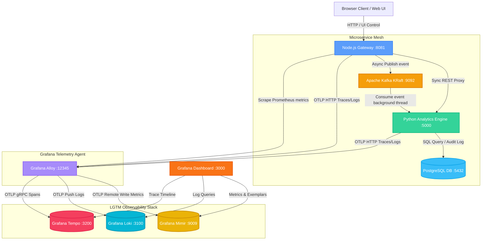

# Architecture Guide — LGTM Telemetry Stack & Microservice Mesh

This document details the high-performance design, event-driven pipelines, and distributed telemetry correlation architecture of our application.

---

## 🗺️ System Topology



---

## 🔄 End-to-End Request Data Lifecycle

### Scenario: Publishing an Event to Kafka
1. **User Interaction**: User clicks **"Publish event to Kafka"** on the dashboard.
2. **Node.js Gateway**:
   - Receives the request, starts a new root span (`trace_id: 4bf92f35...`).
   - Injects the trace context `traceparent` header into the Kafka message headers.
   - Publishes the payload asynchronously to Kafka topic `task-events` on port `9092`.
3. **Kafka Broker**: Receives the event and queues it in the `task-events` partitions.
4. **Python Background Consumer**:
   - Extracts the `traceparent` header from the Kafka event message.
   - Starts a child span linked to the parent `trace_id`.
   - Executes an database query to record the audit log into **PostgreSQL**.
5. **PostgreSQL**:
   - `Psycopg2Instrumentor` captures the execution duration, query command, and creates a database child span.
6. **Telemetry Agent (Alloy)**:
   - Collects OTLP spans and logs from Node.js and Python.
   - Forwards metrics to **Mimir**, logs to **Loki**, and traces to **Tempo**.
7. **Grafana Visualization**:
   - The user opens Grafana and inspects the trace. The entire distributed chain is rendered under a single trace timeline.

---

## 📦 Component Breakdown

### 1. Application Layer
* **Node.js Gateway (`apps/node-app`)**: Express-based portal. Serves the Three.js 3D WebGL topology dashboard and proxies compute, search, and message actions downstream.
* **Python Analytics (`apps/python-app`)**: Flask-based heavy numeric computation engine, running multi-threaded Gunicorn workers.
* **Shared SDKs (`apps/common`)**: Shared OpenTelemetry hooks (`observability.js`, `obs.py`) loaded dynamically based on the global `ENABLE_OBSERVABILITY` flag.

### 2. Infrastructure Layer
* **Apache Kafka (`kafka`)**: Runs in modern KRaft mode (no Zookeeper metadata cluster required) as a lightweight, single-process message broker.
* **PostgreSQL (`postgres`)**: Database persistence engine storing seeded user metadata and Kafka event audit logs.

### 3. Observability & Telemetry Engines
* **Grafana Alloy**: The central collector agent. It scrapes local Prometheus metrics, collects OTLP signals, filters/formats them, and dispatches them to their respective storage.
* **Grafana Mimir**: High-performance, scalable time-series database storing Prometheus metrics.
* **Grafana Loki**: Log aggregation engine indexing system outputs, Gunicorn worker stdout, and application trace context.
* **Grafana Tempo**: Distributed trace visualization engine correlating metrics and log timestamps with system trace spans.
* **Grafana**: Graphical user interface visualization portal querying all backends.

---

## 🔗 Distributed Tracing Context Propagation

The system propagates W3C Trace Context headers across HTTP and Kafka messaging barriers:

```
W3C Header Format: traceparent: 00-[32-hex-trace-id]-[16-hex-parent-span-id]-[2-hex-flags]
Example:           traceparent: 00-4bf92f3577b34da6a3ce929d0e0e4736-00f067aa0ba902b7-01
```

Both microservices leverage global OpenTelemetry context textmap propagators (`W3CTraceContextPropagator`) to serialize and deserialize these headers across downstream calls, linking disparate processes into a single unified trace representation.
