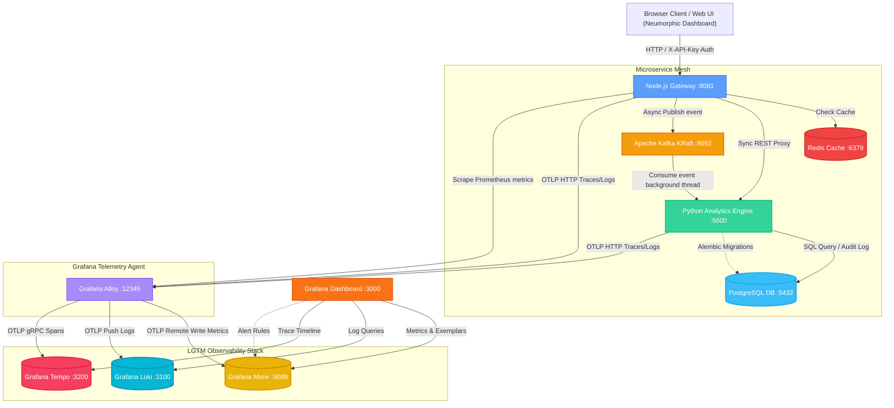

# Architecture Guide — LGTM Telemetry Stack & Microservice Mesh

This document details the high-performance design, event-driven pipelines, and distributed telemetry correlation architecture of our application.

---

## 🗺️ System Topology



---

## 🔄 End-to-End Request Data Lifecycle

### Scenario A: Cached Math Calculation Request
1. **User Request**: User requests a Factorial or Fibonacci calculation on the dashboard UI.
2. **Auth Verification**: The global interceptor attaches `X-API-Key: lgtm-secret-key` to the request headers. Node.js gateway validates the key using `apiKeyAuth` middleware.
3. **Redis Cache Check**: Node.js generates a unique cache key (`fact:n` or `fib:n`) and checks Redis.
   - **Cache Hit**: Returns calculation results instantly ($<2ms$), bypassing downstream services.
   - **Cache Miss**: Continues routing execution to calculate factors, calls Python for downstream analysis, caches the response payload in Redis (5-minute TTL), and returns.

### Scenario B: Kafka DLQ Event Queue Routing
1. **Event Broadcast**: Node.js gateway publishes task payloads asynchronously to the Kafka topic `task-events`.
2. **Background Consumption**: The Python consumer fetches the record, extracts the propagated OTel tracing headers, and attempts writing to PostgreSQL.
3. **Write Failures & Retries**: On database failure, the consumer attempts writes up to 3 times (1-second delay between tries).
4. **Dead-Letter Queue (DLQ) Redirect**: If all 3 attempts fail, the consumer serializes the payload with error details and publishes it to the `task-events-dlq` topic.

---

## 📦 Component Breakdown

### 1. Application Layer
* **Node.js Gateway (`apps/node-app`)**: Express-based portal. Serves the Three.js 3D WebGL topology dashboard and proxies compute, search, and message actions downstream. Hardened with API key authentication middleware.
* **Python Analytics (`apps/python-app`)**: Flask-based heavy numeric computation engine, running multi-threaded Gunicorn workers. Leverages Alembic migration scripts for database setups.
* **Shared SDKs (`apps/common`)**: Shared OpenTelemetry hooks (`observability.js`, `obs.py`) loaded dynamically based on the global `ENABLE_OBSERVABILITY` flag.

### 2. Infrastructure Layer
* **Apache Kafka (`kafka`)**: Runs in modern KRaft mode (no Zookeeper metadata cluster required) as a lightweight, single-process message broker.
* **Redis Cache (`redis`)**: Cache database layer storing pre-calculated responses.
* **PostgreSQL (`postgres`)**: Database persistence engine storing seeded user metadata and Kafka event audit logs.

### 3. Observability & Telemetry Engines
* **Grafana Alloy**: The central collector agent. It scrapes local Prometheus metrics, collects OTLP signals, filters/formats them, and dispatches them to their respective storage.
* **Grafana Mimir**: High-performance, scalable time-series database storing Prometheus metrics.
* **Grafana Loki**: Log aggregation engine indexing system outputs, Gunicorn worker stdout, and application trace context.
* **Grafana Tempo**: Distributed trace visualization engine correlating metrics and log timestamps with system trace spans.
* **Grafana**: Graphical user interface visualization portal querying all backends.

### 4. Infrastructure-as-Code (IaC) Layer
* **AWS Module (`infrastructure/terraform/aws`)**: Provisions a complete VPC topology, routing resources, NAT gateways, and an EKS Kubernetes cluster (`v1.30`) with managed auto-scaling worker node groups.
* **GCP Module (`infrastructure/terraform/gcp`)**: Provisions an auto-scaled regional Google Kubernetes Engine (GKE) cluster in a custom VPC with Cloud NAT configurations for secure container downloads.
* **OCI Module (`infrastructure/terraform/oci`)**: Provisions a Virtual Cloud Network (VCN), OKE Kubernetes cluster, and flexible auto-scaling node pools using VM.Standard.E4.Flex shapes.
* **Terragrunt Wrapper (`infrastructure/terraform/terragrunt.hcl`)**: Manages cloud environments dynamically, generating local/remote state directories and centralized provider configurations DRY-ly across subfolders.

---

## 🔗 Distributed Tracing Context Propagation

The system propagates W3C Trace Context headers across HTTP and Kafka messaging barriers:

```
W3C Header Format: traceparent: 00-[32-hex-trace-id]-[16-hex-parent-span-id]-[2-hex-flags]
Example:           traceparent: 00-4bf92f3577b34da6a3ce929d0e0e4736-00f067aa0ba902b7-01
```

Both microservices leverage global OpenTelemetry context textmap propagators (`W3CTraceContextPropagator`) to serialize and deserialize these headers across downstream calls, linking disparate processes into a single unified trace representation.
