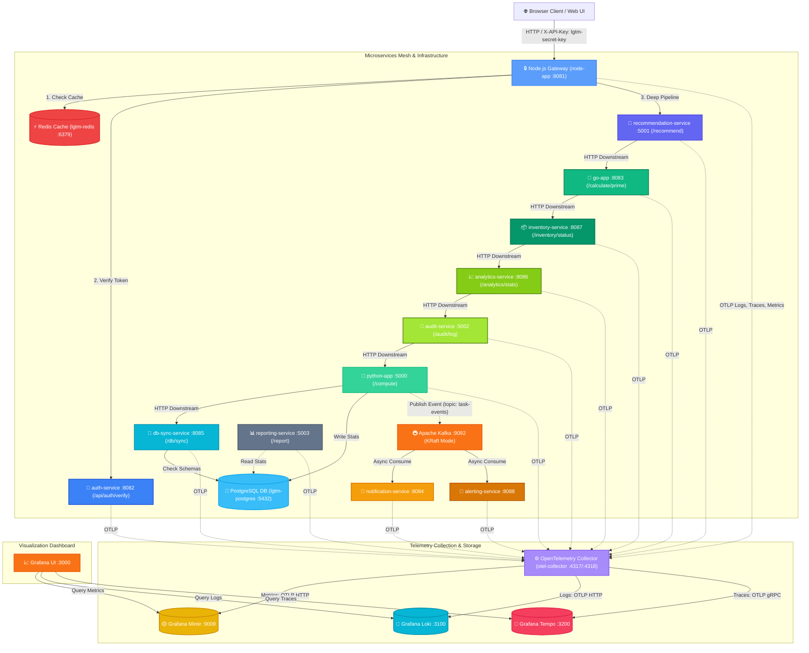

# 🗺️ Microservices Architecture & Endpoint Flow Diagram

This document contains a comprehensive **Mermaid.js** diagram representing the request lifecycle, container ports, message queues, database connections, and the updated **OpenTelemetry Collector** telemetry ingestion flow.

You can import this directly into any markdown viewer, GitHub, or [Mermaid Live Editor](https://mermaid.live).

---

## 🎨 System Flow Diagram (Mermaid.js)

---

## 🔗 Endpoint Reference Table

| Service | Port | Endpoint | Description |
|---|---|---|---|
| **`node-app`** | `8081` | `/` | Web UI / Dashboard (served statically) |
| | | `/calculate/deep/{num}` | Triggers the 12-service downstream cascading trace |
| | | `/calculate/factorial/{num}` | Computes factorial (checks Redis cache first) |
| | | `/calculate/fibonacci/{num}` | Computes fibonacci (checks Redis cache first) |
| **`auth-service`** | `8082` | `/api/auth/verify` | Validates authentication tokens & headers |
| **`recommendation-service`** | `5001` | `/recommend` | Resolves recommendation scores & downstream requests |
| **`go-app`** | `8083` | `/calculate/prime` | Resolves prime number factorizations |
| **`inventory-service`** | `8087` | `/inventory/status` | Resolves inventory availability metrics |
| **`analytics-service`** | `8086` | `/analytics/stats` | Aggregates analytical computing data |
| **`audit-service`** | `5002` | `/audit/log` | Records analytical computations for auditing |
| **`python-app`** | `5000` | `/compute` | Finalizes heavy math computation & publishes Kafka events |
| **`db-sync-service`** | `8085` | `/db/sync` | Verifies and synchronizes schema metadata |
| **`reporting-service`** | `5003` | `/report` | Generates summary stats reports |
